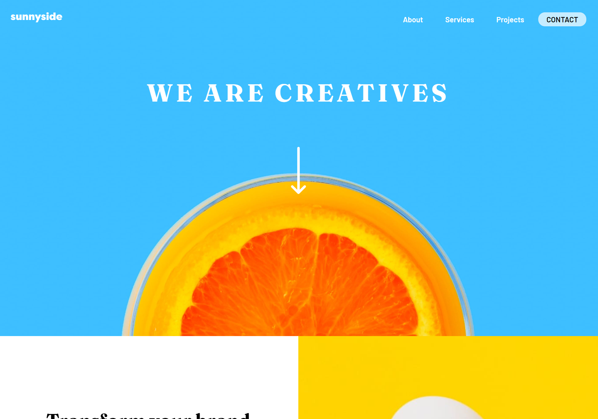
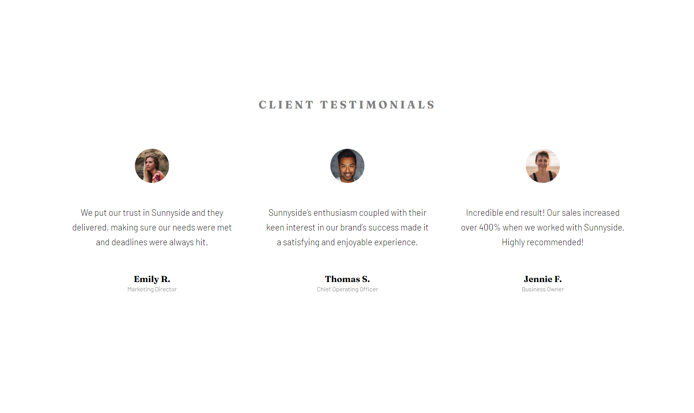
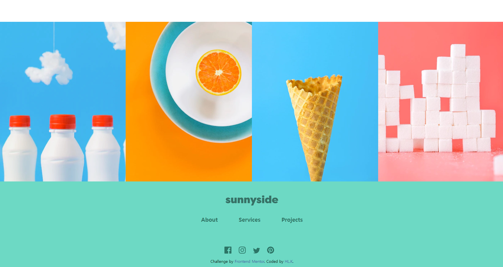
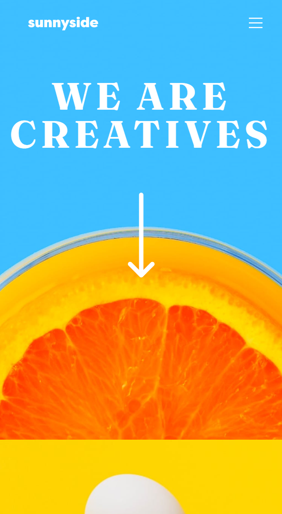
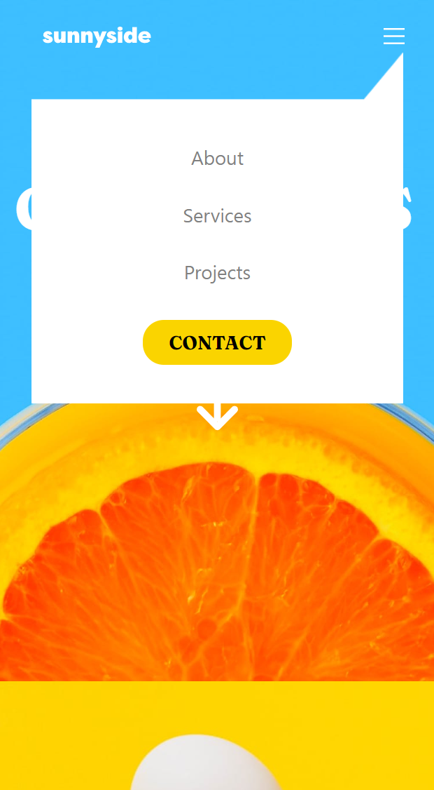

# Sunnyside landing page - 반응형 웹 페이지

## Description

flex box, media query를 사용하여 반응형 웹 페이지를 구현.

## 사용 스택 - Language

- HTML
- CSS
- JavaScript

## 제작 기간

2022.08.01 ~ 08.02

## 디자인 및 소스 참고

[Frontend Mentor](https://www.frontendmentor.io/)

## Preview

\*배포 사이트 : https://hiimhl.github.io/sunnyside-page/

Desktop  

 
 

Mobile  

